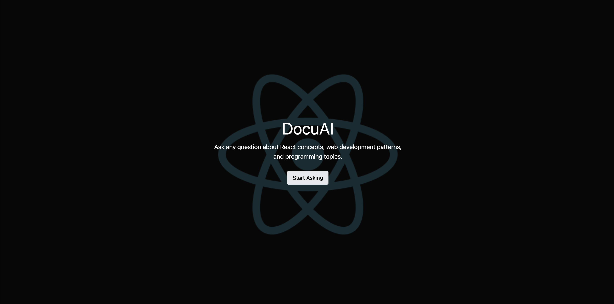
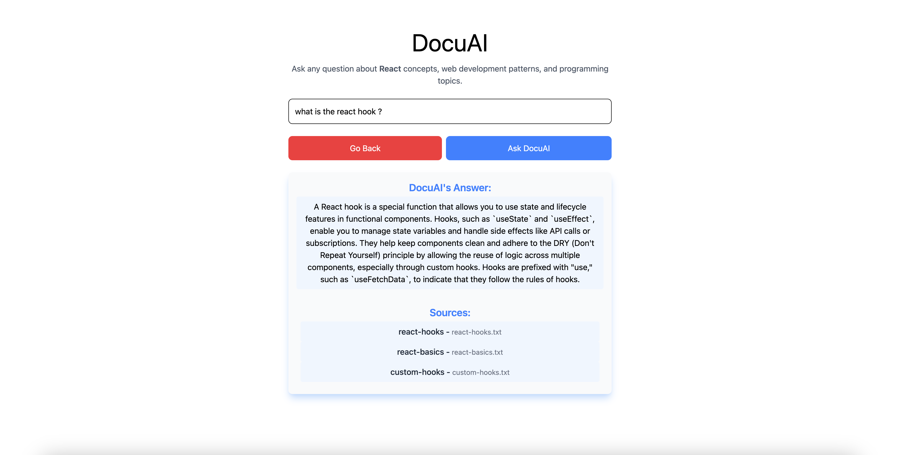
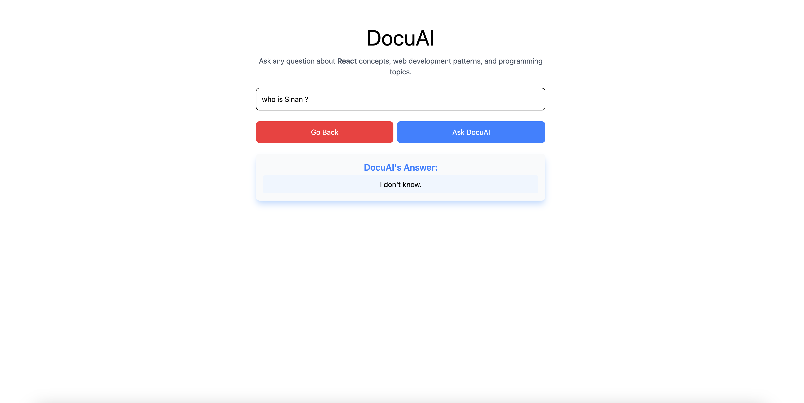

# DocuAI

DocuAI is an interactive web application that allows users to ask programming and web development-related questions, with a special focus on React concepts. It leverages a local **ChromaDB** for storing document embeddings and **OpenAI’s GPT-4o-mini** for generating contextual answers.

## Features

- Ask questions related to React, JavaScript, web development, and software concepts.  
- Retrieve answers with relevant sources from ingested documentation.  
- Responsive UI built with **React**, **Tailwind CSS**, and **ShadCN UI**.  
- Smooth transitions and clean styling for answers and sources.  
- Backend powered by **Node.js**, **Express**, and **ChromaDB**.  
- Connects to **OpenAI’s API** for LLM-powered responses.

## Tech Stack

- **Frontend:** React, TypeScript, Tailwind CSS, ShadCN UI, React Router  
- **Backend:** JavaScript, Node.js, Express, ChromaDB, OpenAI API  
- **Database:** ChromaDB for embeddings  
- **API Communication:** Axios (frontend ↔ backend)

## Screenshots


  


## Getting Started  

```bash
# Backend set up
cd backend
npm install
# Add your OpenAI API key and ChromaDB URL in .env
node ingest.js
npm run dev
```

```bash
# Frontend set up
cd frontend
npm install
npm run dev
```
